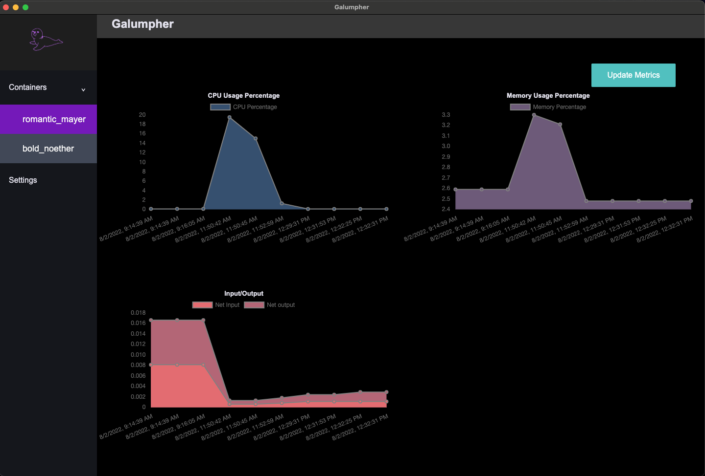

# Galumpher

A Podman monitoring tool built on electron

## Summary 

Galumpher is an open-source developer tool to help monitor the health and status of your Podman containers
that are currently running on your local machine. Galumpher allows users to view important metrics at a quick glance
and update them at the click of a button. 



## Features

- Galumpher will display all of the containers that are currently running on the machine in the dropdown menu located in the sidebar. 
- The main metrics page will display the metrics of the first container on the list by default.
- Clicking on a different container within the dropdown will automatically fetch the most recent metrics for
that container and load them into the metrics display section.
- Key metrics currently available are CPU usage, memory usage, and net input/output.
- All figures are displayed in MB.

## Geting started

### 1. Prerequisites 
- Users must have Podman installed and currently running on their machine.

### 2. Clone this repo using the following command 

```
git clone https://github.com/oslabs-beta/Galumphing.git
```
### 3. Run the following commands 


```
npm install
npm run build
npm start
```
## To contribute

- Fork this repo.
- Pull your fork down to your machine
- Create your own branch based of off dev branch with the following command

```
git checkout -b <yourBranchName> 
```

- Run the following commands 

```
npm install
npm run dev
```
- Push your changes up and create a PR to the Galumpher repo

### Built with

- [Electron](https://www.electronjs.org/)
- [React](https://reactjs.org/)
- [React Router](https://reactrouter.com/)
- [Redux](https://redux.js.org/)
- [Node](https://nodejs.org/)
- [Kubernetes-client](https://github.com/kubernetes-client/)
- [Prometheus](https://prometheus.io/)
- [Material UI](https://mui.com/)
- [Chart.js](https://www.chartjs.org/)

## The Team

- Shelby Carlin [Github](https://github.com/shelbycarlin) - [LinkedIn](https://www.linkedin.com/in/shelbycarlin/)
- Tran Nguyen [Github](https://github.com/Tranimal-N) - [LinkedIn](https://www.linkedin.com/in/tranmcfarlandnguyen/)
- Dennis Ly [Github](https://github.com/dennishly) - [LinkedIn](https://www.linkedin.com/in/dennishly/)
- Jared Veltsos [Github](https://github.com/toastMaduro-hub) - [LinkedIn](https://www.linkedin.com/in/jaredveltsos/)
